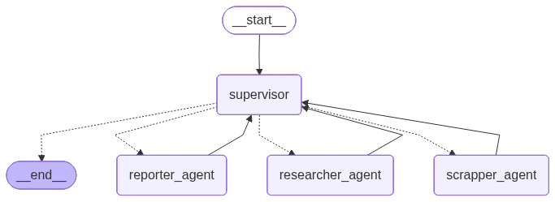

# Deep Research Agent 🤖

Welcome to the **Deep Research Agent** project! This is a sophisticated, multi-agent system designed to perform in-depth, autonomous research on any given topic. It leverages the power of Google's Gemini models and LangGraph to orchestrate a team of specialized AI agents.

## ✨ About The Project

This project automates the entire research process, from finding relevant sources to synthesizing information into a comprehensive report. It's built to be efficient, robust, and easy to use.

## 🚀 Key Features

-   **🤖 Multi-Agent System:** Utilizes a supervisor-worker architecture where a `Supervisor` agent manages a team of specialists:
    -   `Researcher Agent`: Finds the most relevant sources online.
    -   `Scrapper Agent`: Extracts clean, core content from web pages.
    -   `Reporter Agent`: Synthesizes information from all sources into a final report.
-   **🌐 Intelligent Web Search:** Uses Tavily to perform web searches, automatically filtering out irrelevant links like PDFs or pages with access restrictions.
-   **🧹 Smart Content Scraping:** The `web_scraper` tool intelligently removes clutter (like ads, navbars, and footers) from web pages, returning only the main article content in clean Markdown.
-   **✍️ Automated Report Generation:** Aggregates and analyzes information from multiple sources to produce a single, objective, and well-structured research report.
-   **📈 Powered by LangGraph:** The entire workflow is orchestrated as a state machine using LangGraph, ensuring a reliable and sequential process.

## 🔧 How It Works

The agent operates through a clear, step-by-step workflow managed by the `Supervisor` agent.

1.  **Topic Input:** The user provides a research topic.
2.  **Find Sources:** The `Supervisor` delegates the topic to the `researcher_agent`, which performs a web search and returns a list of relevant URLs.
3.  **Extract Information:** For each URL, the `Supervisor` tasks the `scrapper_agent` to visit the page and extract its core textual content.
4.  **Synthesize Report:** Once all sources have been scraped, the `Supervisor` passes the collected texts to the `reporter_agent`. This agent analyzes and synthesizes the information to create the final, comprehensive report.
5.  **Final Output:** The `Supervisor` presents the finished report to the user.

## 🖼️ Workflow

Below is a visual representation of the agent's architecture and process.



## 📂 Core Components

-   `agents.py`: Defines the three specialist agents (`researcher`, `scrapper`, `reporter`) and the `supervisor` that orchestrates them.
-   `tools.py`: Contains the custom tools for `web_search`, `web_scraper`, and `write_to_file`.
-   `prompts.py`: Stores the detailed system prompts that guide the behavior and expertise of each agent.
-   `langgraph.json`: The JSON representation of the compiled LangGraph agent, used by the development studio.
-   `requirements.txt`: A list of all the Python dependencies needed for the project.

## 🏁 Getting Started

Follow these steps to get the project up and running on your local machine.

### Prerequisites

-   Python 3.9+
-   API keys for:
    -   Google Gemini (or another supported LLM)
    -   Tavily AI
    -   LangSmith

### Installation

1.  **Clone the repository:**
    ```sh
    git clone https://github.com/scbarut/deep-research-agent.git
    cd deep-research-agent
    ```
2.  **Create a `.env` file:**
    Create a file named `.env` in the root directory and add your API keys. Also, enable LangSmith tracing.
    ```
    GOOGLE_API_KEY="YOUR_GEMINI_API_KEY"
    TAVILY_API_KEY="YOUR_TAVILY_API_KEY"
    LANGSMITH_API_KEY="YOUR_LANGSMITH_API_KEY"
    LANGCHAIN_TRACING_V2=true
    ```
3.  **Install dependencies:**
    ```sh
    pip install -r requirements.txt
    ```

## 🏃‍♀️ Usage

This project is designed to be run with the LangGraph development studio.

1.  **Start the LangGraph Studio:**
    Run the following command in your terminal from the project's root directory:
    ```sh
    langgraph dev --allow-blocking
    ```
2.  **Open the Studio:**
    Navigate to the URL provided in the terminal (usually `http://127.0.0.1:5891/`).

3.  **Interact with the Agent:**
    Use the LangGraph Studio interface to send your research topic to the agent and see the multi-agent workflow in action.

---
